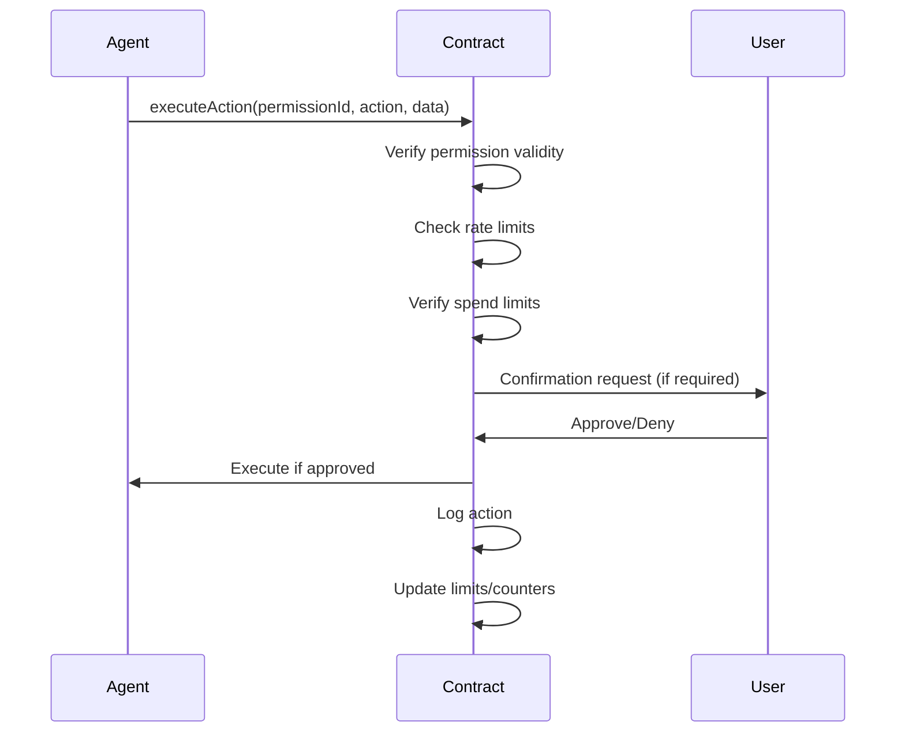

# LCS-003: Agent Permission Standard

**Version**: 0.1.0  
**Status**: Draft  
**Created**: 2025-08-12  
**Requires**: LCS-001, LCS-002  
**Authors**: LLMConsent Foundation

## Abstract

This standard defines how autonomous AI agents request, receive, and manage permissions to perform actions on behalf of users. It establishes delegation chains, capability boundaries, and revocation mechanisms for agent authorities.

## Motivation

As AI agents become more autonomous, they need:
- Clear permission boundaries for actions
- Delegation mechanisms for multi-agent systems
- Financial and operational limits
- Audit trails for agent actions
- Emergency revocation capabilities

This standard creates a secure, auditable system for agent permissions.

## Specification

### 1. Agent Identity

```solidity
struct AgentIdentity {
    // Unique Identification
    bytes32 agentId;          // Hash of agent properties
    address agentAddress;      // On-chain address
    string did;                // Decentralized identifier
    
    // Capabilities
    bytes32[] capabilities;    // What agent can do
    string modelType;          // gpt-4, claude, llama, etc.
    uint256 version;
    
    // Trust & Reputation
    uint256 trustScore;        // Community-driven score
    uint256 totalActions;      // Lifetime action count
    uint256 successRate;       // Success percentage
    
    // Certification
    bytes32[] certifications;  // Compliance certificates
    uint256 certExpiry;
}
```

### 2. Permission Structure

```solidity
struct AgentPermission {
    // Scope
    uint256 permissionId;
    address grantor;           // Who gave permission
    bytes32 agentId;
    
    // Capabilities
    enum ActionType {
        READ_DATA,      // Access user data
        WRITE_DATA,     // Modify user data
        EXECUTE_TXN,    // Execute blockchain transactions
        SPEND_FUNDS,    // Spend user funds
        DELEGATE,       // Delegate to other agents
        EXTERNAL_API,   // Call external APIs
        TRAIN_MODEL     // Use data for training
    }
    uint8 allowedActions;      // Bitmask of ActionTypes
    
    // Boundaries
    uint256 maxSpend;          // Maximum funds (wei)
    uint256 maxGasPerTx;       // Gas limit per transaction
    uint256 rateLimit;         // Actions per hour
    string[] allowedDomains;   // External domains accessible
    
    // Temporal
    uint256 grantedAt;
    uint256 expiresAt;
    uint256 lastUsed;
    
    // Control
    bool revocable;
    bool requiresConfirmation; // User confirms each action
    uint256 cooldownPeriod;    // Time before re-activation
}
```

### 3. Delegation Chain

```solidity
struct DelegationChain {
    uint256 rootPermissionId;
    
    struct Delegation {
        bytes32 fromAgent;
        bytes32 toAgent;
        uint8 delegatedActions;   // Subset of parent permissions
        uint256 maxDepth;         // How deep can delegation go
        bool revocable;
    }
    
    Delegation[] chain;
}
```

### 4. Core Operations

#### 4.1 Request Permission
```solidity
function requestPermission(
    bytes32 agentId,
    uint8 requestedActions,
    uint256 duration,
    string calldata justification
) returns (uint256 requestId)
```

#### 4.2 Grant Permission
```solidity
function grantPermission(
    uint256 requestId,
    uint256 maxSpend,
    uint256 rateLimit,
    bool requiresConfirmation
) returns (uint256 permissionId)
```

#### 4.3 Execute Action
```solidity
function executeAction(
    uint256 permissionId,
    ActionType action,
    bytes calldata actionData
) returns (bytes memory result)
```

#### 4.4 Delegate Permission
```solidity
function delegatePermission(
    uint256 permissionId,
    bytes32 toAgentId,
    uint8 delegatedActions,
    uint256 duration
) requires (DELEGATE permission)
```

#### 4.5 Revoke Permission
```solidity
function revokePermission(
    uint256 permissionId,
    bool revokeChildren  // Revoke delegated permissions too
)
```

### 5. Action Execution Protocol



### 6. Safety Mechanisms

#### 6.1 Circuit Breakers
```solidity
struct CircuitBreaker {
    uint256 maxSpendPerHour;
    uint256 maxActionsPerHour;
    uint256 unusualActivityThreshold;
    bool emergencyStop;
}
```

#### 6.2 Multi-Signature Requirements
For high-risk actions, require multiple confirmations:
```solidity
mapping(ActionType => uint256) requiredConfirmations;
```

#### 6.3 Honeypot Detection
Detect malicious agents trying to exceed permissions:
```solidity
function detectAnomalous(uint256 permissionId) returns (bool);
```

### 7. Audit Trail

All agent actions MUST be logged:

```solidity
event ActionExecuted(
    bytes32 indexed agentId,
    uint256 indexed permissionId,
    ActionType action,
    bytes data,
    bool success,
    uint256 timestamp
);
```

### 8. Agent Certification

Agents can obtain certifications for compliance:

```solidity
struct Certification {
    string certType;        // "GDPR", "SOC2", "SAFE_AI"
    address certifier;      // Who issued cert
    uint256 issuedAt;
    uint256 validUntil;
    bytes32 evidenceHash;   // Proof of compliance
}
```

### 9. Permission Templates

Standard templates for common agent types:

```javascript
const TEMPLATES = {
  TRADING_BOT: {
    actions: ["READ_DATA", "EXECUTE_TXN", "SPEND_FUNDS"],
    maxSpend: "1 ETH",
    rateLimit: 10,
    requiresConfirmation: true
  },
  
  PERSONAL_ASSISTANT: {
    actions: ["READ_DATA", "WRITE_DATA", "EXTERNAL_API"],
    maxSpend: "0",
    rateLimit: 100,
    requiresConfirmation: false
  },
  
  RESEARCH_AGENT: {
    actions: ["READ_DATA", "TRAIN_MODEL"],
    maxSpend: "0",
    rateLimit: 50,
    requiresConfirmation: false
  }
};
```

## Implementation Notes

### Gas Optimization
- Pack struct fields efficiently
- Use bitmasks for permissions
- Batch permission checks
- Cache frequently accessed permissions

### Integration Points
- Wallet integration for confirmations
- Notification systems for actions
- Dashboard for permission management
- Analytics for agent behavior

## Rationale

**Why granular permissions?** Different agents need different capabilities.

**Why delegation chains?** Enables complex multi-agent workflows.

**Why on-chain audit?** Provides irrefutable record of agent actions.

**Why certification?** Helps users identify trustworthy agents.

## Security Considerations

- Compromised agents could drain funds
- Delegation chains could be exploited
- Rate limiting critical for damage control
- Need secure off-chain confirmation channel

## Examples

### Granting Trading Bot Permission
```python
permission = await consent_client.grant_agent_permission(
    agent_id="trading_bot_v2",
    actions=["EXECUTE_TXN", "SPEND_FUNDS"],
    limits={
        "max_spend": Web3.to_wei(0.1, "ether"),
        "rate_limit": 5,  # 5 trades per hour
        "requires_confirmation": True
    },
    duration=7*24*3600  # 7 days
)
```

### Multi-Agent Delegation
```javascript
// Main assistant delegates to specialist
await mainAssistant.delegatePermission({
  to: "research_specialist_agent",
  actions: ["READ_DATA"],
  maxDepth: 1,  // Can't delegate further
  duration: 3600  // 1 hour
});
```

## Copyright

This standard is released under CC0 - No Rights Reserved.

## Citation

```
LCS-003: Agent Permission Standard. (2025).
LLMConsent Foundation. https://llmconsent.org/standards/LCS-003
```