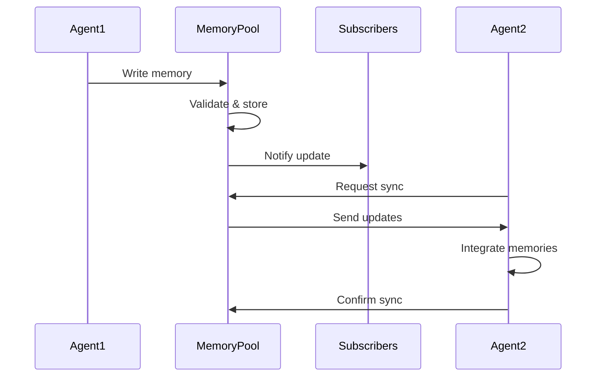

# LCS-004: Cross-Agent Memory Standard

**Version**: 0.1.0  
**Status**: Draft  
**Created**: 2025-08-12  
**Requires**: LCS-001, LCS-002, LCS-003  
**Authors**: LLMConsent Foundation

## Abstract

This standard defines how AI agents share memories and context across different systems, enabling continuous and coherent user experiences while maintaining privacy and user control over shared information.

## Motivation

Current problems with agent memory:
- Each agent maintains isolated memory
- Users repeat context to every agent
- No learning transfer between systems
- Fragmented user experience
- No control over memory persistence

Cross-agent memory enables seamless experiences across all AI interactions.

## Specification

### 1. Memory Structure

```solidity
struct Memory {
    // Identity
    bytes32 memoryId;
    address owner;
    bytes32 creatingAgent;
    
    // Content
    bytes32 contentHash;       // IPFS hash of memory content
    
    // Metadata
    enum MemoryType {
        PREFERENCE,    // User preferences
        CONTEXT,       // Conversation context
        KNOWLEDGE,     // Learned facts
        PROCEDURE,     // How to do something
        RELATIONSHIP,  // Inter-entity relationships
        TEMPORAL      // Time-based events
    }
    MemoryType memType;
    
    // Properties
    uint256 confidence;        // 0-10000 (basis points)
    uint256 timestamp;
    uint256 accessCount;
    uint256 lastAccessed;
    
    // Sharing
    bool isPublic;
    address[] authorizedAgents;
    
    // Lifecycle
    uint256 ttl;              // Time to live
    bool permanent;
    uint256 importance;        // For pruning decisions
}
```

### 2. Memory Pool Structure

```solidity
struct MemoryPool {
    // Identity
    bytes32 poolId;
    address owner;
    
    // Memories
    bytes32[] memoryIds;
    mapping(bytes32 => uint256) memoryIndex;
    
    // Access Control
    mapping(address => bool) readAccess;
    mapping(address => bool) writeAccess;
    
    // Policies
    uint256 maxSize;
    uint256 pruningThreshold;
    bool autoMerge;            // Merge similar memories
    bool deduplication;        // Remove duplicates
}
```

### 3. Memory Content Format

```json
{
  "version": "1.0.0",
  "memory_id": "0x...",
  "type": "PREFERENCE",
  "content": {
    "subject": "communication_style",
    "predicate": "prefers",
    "object": "bullet_points",
    "context": "technical_discussions"
  },
  "metadata": {
    "confidence": 0.95,
    "source": "direct_statement",
    "supporting_evidence": ["memory_id_1", "memory_id_2"]
  },
  "privacy": {
    "encryption": "aes-256-gcm",
    "visibility": "authorized_agents_only",
    "no_training": true
  }
}
```

### 4. Core Operations

#### 4.1 Create Memory
```solidity
function createMemory(
    MemoryType memType,
    bytes32 contentHash,
    uint256 confidence,
    uint256 ttl
) returns (bytes32 memoryId)
```

#### 4.2 Share Memory
```solidity
function shareMemory(
    bytes32 memoryId,
    address withAgent,
    bool allowWrite
)
```

#### 4.3 Query Memories
```solidity
function queryMemories(
    bytes32 poolId,
    MemoryType memType,
    uint256 minConfidence,
    uint256 limit
) returns (bytes32[] memory memoryIds)
```

#### 4.4 Merge Memories
```solidity
function mergeMemories(
    bytes32[] memory memoryIds,
    uint256 mergeStrategy  // 0=average, 1=maximum, 2=recent
) returns (bytes32 mergedMemoryId)
```

#### 4.5 Forget Memory
```solidity
function forgetMemory(
    bytes32 memoryId,
    bool cascadeDelete  // Delete dependent memories
)
```

### 5. Memory Synchronization Protocol



### 6. Conflict Resolution

When memories conflict:

```python
def resolve_conflict(memory1, memory2):
    # Recency preferred
    if abs(memory1.timestamp - memory2.timestamp) > threshold:
        return newer_memory
    
    # Confidence weighted
    if memory1.confidence > memory2.confidence * 1.5:
        return memory1
    
    # Source authority
    if memory1.source in trusted_sources:
        return memory1
    
    # Create composite
    return merge_memories([memory1, memory2])
```

### 7. Privacy Layers

```solidity
enum PrivacyLevel {
    PUBLIC,        // Any agent can read
    AUTHORIZED,    // Specific agents only
    ENCRYPTED,     // Encrypted, key required
    EPHEMERAL,     // Auto-delete after use
    NO_TRAINING    // Cannot be used for model training
}
```

### 8. Memory Importance Scoring

```python
def calculate_importance(memory):
    score = 0
    score += memory.access_count * 10
    score += memory.confidence * 5
    score += recency_weight(memory.timestamp)
    score += source_authority(memory.creating_agent)
    score += user_rating(memory.user_feedback)
    return min(score, 10000)  # Cap at 10000
```

### 9. Cross-Agent Communication

Agents must follow this protocol for memory sharing:

1. **Discovery**: Query available memory pools
2. **Authorization**: Request access to pools
3. **Synchronization**: Pull/push memory updates
4. **Conflict Resolution**: Handle contradictions
5. **Garbage Collection**: Prune outdated memories

### 10. Memory Lifecycle

```
Created → Active → Stale → Archived → Forgotten
   |         |        |         |          |
   ↓         ↓        ↓         ↓          ↓
Shared   Updated  Reduced   Compressed  Deleted
         Access   Priority    Storage
```

## Implementation Notes

### Storage Strategy
- Hot memories: On-chain references
- Warm memories: IPFS with caching
- Cold memories: Arweave/Filecoin
- Ephemeral: In-memory only

### Performance Requirements
- Memory write: <500ms
- Memory read: <50ms
- Sync latency: <2 seconds
- Query response: <100ms

### Scalability Considerations
- Hierarchical memory pools
- Bloom filters for quick lookups
- Memory compression for storage
- Lazy loading for large pools

## Rationale

**Why shared memory?** Enables coherent experience across all AI agents.

**Why structured format?** Allows semantic understanding and merging.

**Why importance scoring?** Necessary for bounded memory systems.

**Why privacy layers?** Users need granular control over information sharing.

## Security Considerations

- Memory poisoning attacks
- Privacy leaks through inference
- Unauthorized memory access
- Memory bombing (DoS)
- Cross-agent information leakage

## Examples

### Creating a Preference Memory
```javascript
const memory = await memoryPool.create({
  type: "PREFERENCE",
  content: {
    subject: "meeting_style",
    predicate: "prefers", 
    object: "video_off",
    context: "morning_meetings"
  },
  confidence: 0.9,
  ttl: 30 * 24 * 3600,  // 30 days
  privacy: "AUTHORIZED"
});
```

### Agent Accessing Shared Memory
```python
# Agent requests user's preferences
memories = await memory_client.query(
    pool_id=user_pool,
    mem_type=MemoryType.PREFERENCE,
    min_confidence=0.7
)

# Process memories
for memory in memories:
    if memory.subject == "communication_style":
        adapt_style(memory.object)
```

### Syncing Across Agents
```typescript
// Assistant syncs context to specialist
await assistant.shareMemoryPool({
  poolId: conversationPool,
  withAgent: specialistAgent,
  permissions: ["READ"],
  duration: 3600  // 1 hour
});
```

## Copyright

This standard is released under CC0 - No Rights Reserved.

## Citation

```
LCS-004: Cross-Agent Memory Standard. (2025).
LLMConsent Foundation. https://llmconsent.org/standards/LCS-004
```